# Extracting Data from Receipts with Microsoft Cognitive Services #

## Problem Statement ##

To facilitate faster expense processing, we want to extract certain information from printed receipts. Re-keying info is never fun, so we want to try and extract the key information automatically from a photos of receipts.

## Key technologies ##

Receipt API:

- [Computer Vision API 1.0 - Optical Character Recognition (OCR)](https://docs.microsoft.com/en-us/azure/cognitive-services/Computer-vision/Home)
- [ASP.NET Core Web Application - Web API](https://docs.microsoft.com/en-us/aspnet/core/tutorials/first-web-api)
- [Azure Web App](https://azure.microsoft.com/en-us/services/app-service/web/)
- [C# in Visual Studio 2017 Preview 4](https://www.visualstudio.com/vs/preview/)

Mobile App (not in this repo):

- [Xamarin Forms](https://developer.xamarin.com/guides/xamarin-forms/)
- [Visual Studio Mobile Center](https://www.visualstudio.com/vs/mobile-center/)
- [Visual Studio Team Services w/GIT](https://www.visualstudio.com/team-services/git/)

## Solution overview ##

This solution provides a Receipt API that itself uses the Microsoft Cognitive Services Computer Vision OCR (Optical Character Recognition) to read text off of an image of a printed receipt.  A client app - could be a Xamarin Mobile App, a batch process, a chat bot dialog, or other - will call the API sending it an image of a receipt.  The API will process the image and return the transcription of the recognised text in the receipt image, along with key data items like Tax Number, Receipt Date, and Receipt Total, in a JSON document.

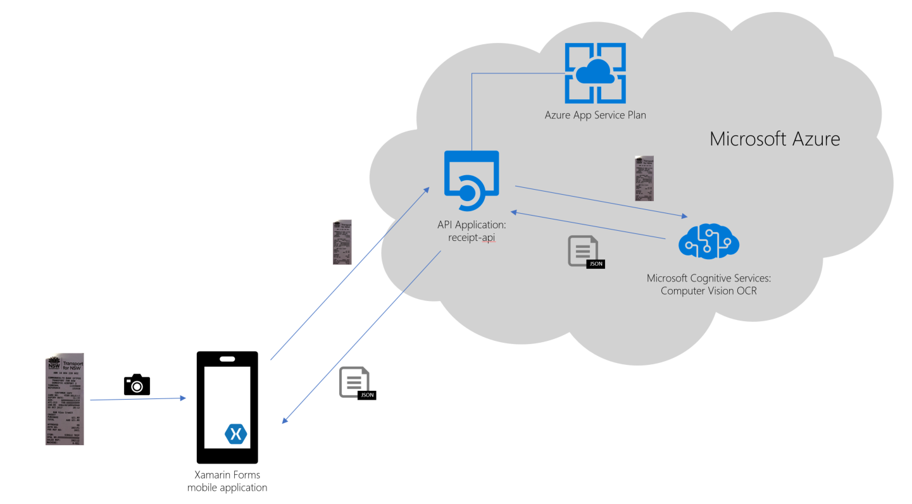

Workflow:

1. Client captures image of receipt (typically with device camera)
2. Client sends image to Receipt API
3. Receipt API will send the image to Cognitive Services Computer Vision OCR API
4. Receipt API receives JSON containing text from OCR API
5. Receipt API reassembles the regions/lines/words parsed by OCR into lines of text resembling the original receipt
6. Receipt API prcoesses the lines and uses patterns and RegEx to find and extract the key fields including: Receipt Total, Tax Number, and Receipt Date
7. Client receives JSON containing receipt lines and extracted fields
8. Client continues with receipt processing

## Technical delivery ##

### Code Disclaimer ###

This is SAMPLE code - not production code.  You are welcome to take, reuse, modify, productionize yourself - but the code comes with no warranties!

### Components ###

For this solution, we built two components:

1. Xamarin Forms Mobile App - cross-platform mobile app that runs on iOS, Android, and Windows UWP, which allows the user to capture a photo of a receipt, or choose an image from the phone gallery, and submit to the Receipt API for processing.  (Not included in this repository)
2. [Receipt API](https://github.com/nzregs/receipt-api) - receives an image, uses OCR service to recognize text, processes text, and return results to the client app

### Xamarin FOrms Mobile App ###

The mobile client test app is not (yet) included in this repo. Check out the [xamarin-forms-samples](https://github.com/xamarin/xamarin-forms-samples) repo for general cross platform mobile dev code samples

### Receipt API ###

The Receipt API is built as a .NET Core Web API and hosted in an Azure Web App.

||Receipt API   |
|--:|---|
|Method|HTTP POST   |
|Input|an image contained in the HTTP BODY using byte array and  application/octet-stream content type (as is used for Microsoft Cognitive Services APIs)|
|Output|JSON containing textual representation of the Receipt image, and some key fields|

#### Prerequisites ####

- Azure account (get a free account here: [aka.ms/getazure](http://aka.ms/getazure))
- Visual Studio 2017 (Pro, Enterprise, or Free Community Edition [here](https://www.visualstudio.com/vs/))

#### Setting up the Azure Web App ####

From the [Azure Portal](https://portal.azure.com) create a new Web App using Windows. You can choose an existing App Service Plan, or create a new one.  In this instance, i've chosen to create a new App Service Plan selecting the Free tier.

1. Create Web App 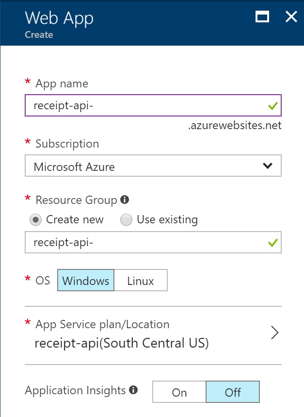

2. Create App Service Plan 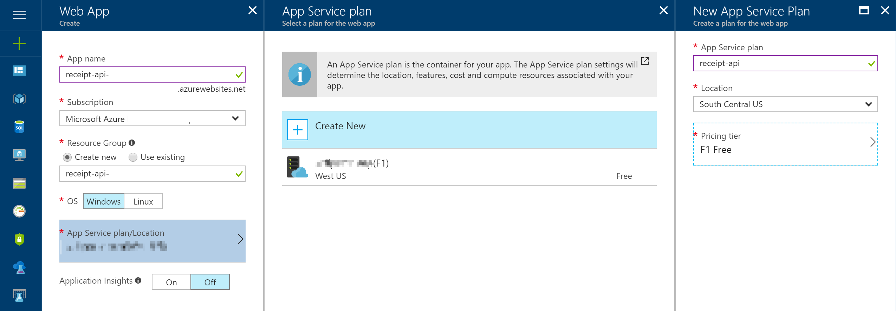

#### Creating the .NET Core Web API ####

In Visual Studio 2017, in my case VIsual Studio 2017 Preview 4, select New Project and choose the "ASP.NET Core Web Application" project template, followed by the "Web API" template.  After a few seconds you should have the base code for your .NET Core Web API.

Creating the new .NET Core Web API 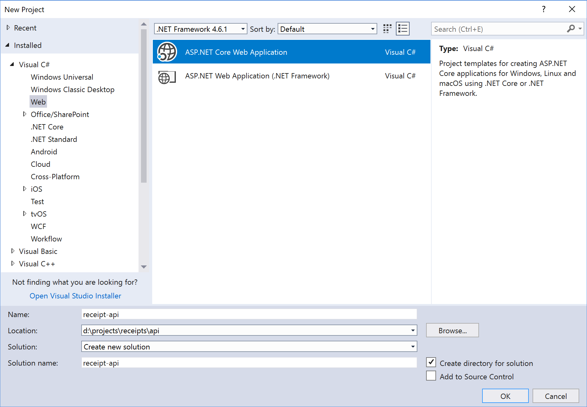

Selecting the Web API template: 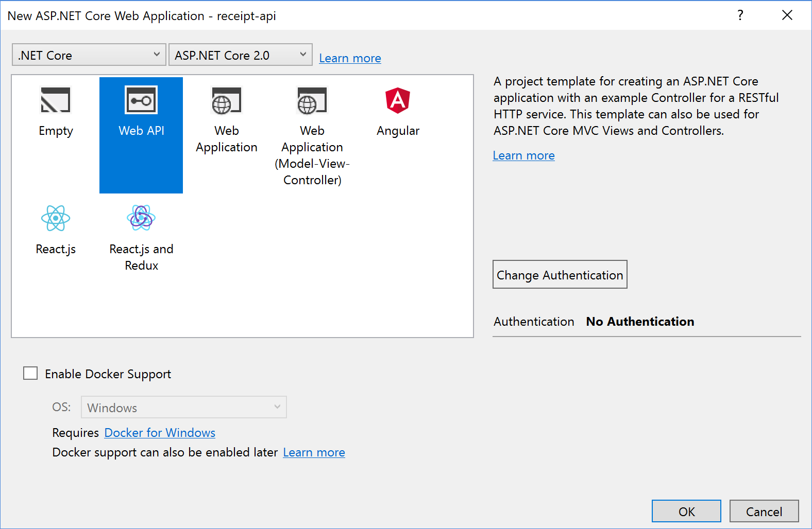

#### Adding Media Formatters for accepting images ####

If you simply try to accept an image posted to your new API using the [FromBody] variable, you will get a `415 Unsupported Media` error message.  This is because the input formatter is not configured out of the box to handle the byte array type.

I got stuck on this for a while, until coming across [this post](https://stackoverflow.com/questions/44090784/unsupported-media-types-when-post-to-web-api/44823478) on stack overflow which led me to a Github repo from Daniel Earwicker - [ByteArrayFormatters](https://github.com/danielearwicker/ByteArrayFormatters) demonstrating exactly how to handle this by adding an input formatter class.  I chose to add the classes directly to my project, however Daniel has provided these classes in Nuget if you search for [Earwicker.ByteArrayFormatters](https://www.nuget.org/packages/Earwicker.ByteArrayFormatters).

1. Add a folder "Formatters" to the project
2. Deploy the three ByteArrayFormatter classes in the Formatters folder.
3. Modify your Startup.cs to reference the formatters using the following code

in Startup.cs, add a using statement first:

```C#
using ByteArrayFormatters;
```

then modify the startup class to load the formatters by replacing:

```C#
public void ConfigureServices(IServiceCollection services)
        {
            services.AddMvc();
        }
```

with:

```C#
public void ConfigureServices(IServiceCollection services)
        {
            services.AddMvc((options =>
            {
                options.InputFormatters.Add(new ByteArrayInputFormatter());
                options.OutputFormatters.Add(new ByteArrayOutputFormatter());
            }));
        }
```

#### Modifying the POST to accept the image byte array content ####

With the new byte formatter classes deployed, we are now to able to modify the default Post handler in ValuesController.cs to accept an image in byte array format.

In ValuesController.cs, replace:

```C#
        // POST api/values
        [HttpPost]
        public void Post([FromBody]string value)
        {
        }
```

with:

```C#
        // POST api/values
        [HttpPost]
        public void Post([FromBody] byte[] content)
        {
        }
```

At this point you should be able to run up the API project, and send an image in via [Postman](https://www.getpostman.com/) or another tool.

For Postman you would do the following:
1. create a new POST request, using the API URL that Visual Studio gives you in the browser when you run it up, in my case [http://localhost:54292/api/values](http://localhost:54292/api/values)
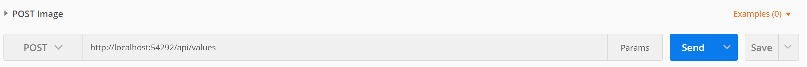

2. attach a test image to the request by navigating to the Body tab, selecting Binary, and choosing your file
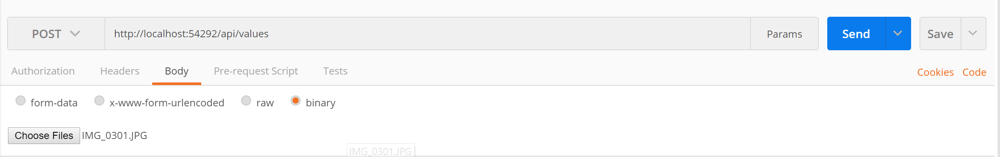

3. add a content type header to tell the api you're sending application/octet-stream encoded content
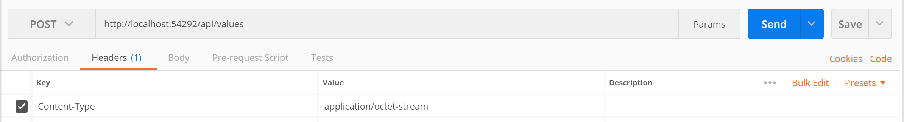

4. hit SEND and see the result - should be `Status: 200 OK` _(a failure would show a Status of `415 Unsupported Media Type` - this could be because you forgot to add the content-type header, you didnt set up the byte array input formatters in your project, or you didnt modify the POST to accept `byte[]` from the body)_
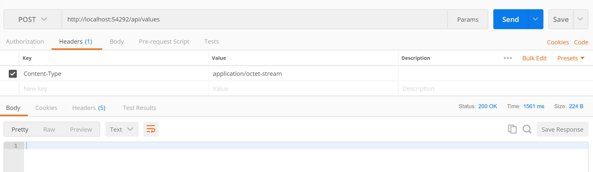

#### Sending the image to Computer Vision OCR API ####

We now have a basic API that can receive the image, so next step is to send that image to the Microsoft Cognitive Service Computer Vision OCR API to extract any (and all) text.

#### Obtain a Computer Vision API Key ####

For this you'll need a Microsoft Cognitive Services Computer Vision API key.  Follow the steps here to get your free key: [https://azure.microsoft.com/en-us/try/cognitive-services/](https://azure.microsoft.com/en-us/try/cognitive-services/)

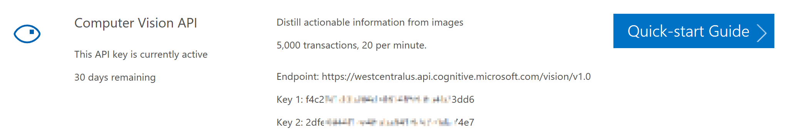

#### Create a helper class for the OCR processing ####

I don't want to write all the code inside the values controller, so I added a "Helpers" folder and created an "OCRProcessing.cs" class inside that.

Inside this class I run an Asynchronous Task that initiates the OCR processing.  Because the calls to Computer Vision OCR API are async, it is better to wrap this in a task.

First added the additonal using statements for the HTTP Client:

```C#
using System.Net.Http;
using System.Net.Http.Headers;
```

Then added the task which takes a byte array image, sends to OCR API, receives JSON text, returns the JSON result as string.  We'll change this later to return a new Receipt class that we create:

```C#
namespace receipt_api
{
    public class OCRProcessing
    {
        public async Task<string> CallComputerVisionOCRAsync(byte[] image)
        {
            using (var client = new HttpClient())
            {
                string apikey = "f4c2@@@@@@@@@@@@@@@@@@@@@@@@3dd6";
                string apiendpoint_ocr = @"https://westcentralus.api.cognitive.microsoft.com/vision/v1.0/ocr";

                // Request headers.
                client.DefaultRequestHeaders.Add("Ocp-Apim-Subscription-Key", apikey);

                // Request parameters. Set languague to "unknown" and detect orientation true
                string requestParameters = "language=unk&detectOrientation=true";

                // Construct the API URI
                string uri = apiendpoint_ocr + "?" + requestParameters;

                // attach image content passed in via post

                var content = new ByteArrayContent(content: image);
                content.Headers.ContentType = new MediaTypeHeaderValue(mediaType: "application/octet-stream");

                // send to Computer Vision OCR
                var result = await client.PostAsync(requestUri: uri, content: content);
                result.EnsureSuccessStatusCode();

                // fetch string result and return
                var jsonstring = await result.Content.ReadAsStringAsync();

                return jsonstring;
            }
        }
    }
}
```

#### Call helper class from API controller ####

Next, we'll modify our API controller to call this new helper method and return that string.  Originially it was a void - with no return type.  We're going to switch this to an async Task too and return the string.

in ValuesController.cs replace:

```C#
  // POST api/values
        [HttpPost]
        public void Post([FromBody] byte[] content)
        {
        }
```

with the following:

```C#
// POST api/values
        [HttpPost]
        public async Task<string> Post([FromBody] byte[] content)
        {
            OCRProcessing ocr = new OCRProcessing();
            return await ocr.CallComputerVisionOCRAsync(content);
        }
```

and now when we re-run that Postman test from above, we will (hopefully) get a JSON string returned looking something like this:
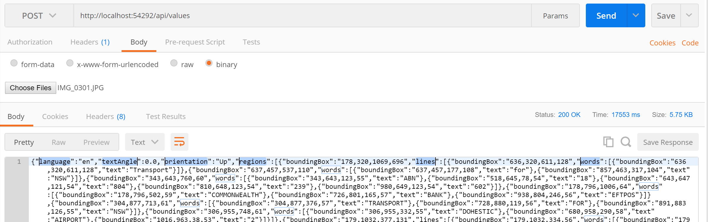

#### Structure of Cognitive Services Computer Vision API Response ####

The structure of the response we get back from the Computer Vision OCR API is seen in the Postman response above.  Returned are a number of regions, lines, and words.  That looks basically like this:

```json
{
    "language": "en",
    "textAngle": 0.0,
    "orientation": "Up",
    "regions": [
        {
            "boundingBox": "178,320,1069,696",
            "lines": [
                {
                    "boundingBox": "637,457,537,110",
                    "words": [
                        {
                            "boundingBox": "637,457,177,108",
                            "text": "This"
                        },
                        {
                            "boundingBox": "857,463,317,104",
                            "text": "Brown"
                        }
                    ]
                }]
        }]
}
```

On first glance it looks nicely structured, and easy to work with.  It wasn't quite what we wanted though.  The actual output took a line such as:

```TXT
TOTAL       AUD $21.80
```

and split it into two regions, one with one line and one word (Total) and the other with one line and two words (AUD, $21.80).

```TXT
TOTAL
AUD $21.80
```

 Why was this a problem?  We needed to process a line that said "TOTAL AUD $21.80" in order to get the context (TOTAL) for the number (21.80).

Here is a look at how some of the regions, lines, and words were returned for my test receipt:
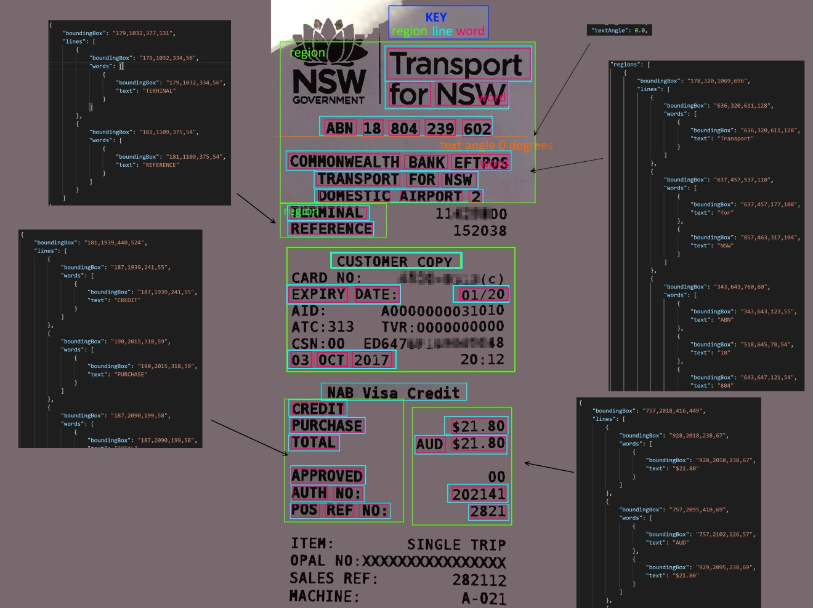

#### Creating some objects for easier data manipulatuion ####

Before actually starting the work to tidy up the OCR output, i added a couple of object classes - **OCRVisionResponse** to deserialize the OCR JSON into, and **Receipt** to ultimately represent the receipt as a sorted list of lines of text instead of a jumble of regions, lines, and words.

The Models\ComputerVisionOCR.cs class

```c#
namespace receipt_api
{
    public class OCRVisionResponse
    {
        public string language { get; set; }
        public float textAngle { get; set; }
        public string orientation { get; set; }
        public Region[] regions { get; set; }
    }

    public class Region
    {
        public string boundingBox { get; set; }
        public Line[] lines { get; set; }
    }

    public class Line
    {
        public string boundingBox { get; set; }
        public Word[] words { get; set; }
    }

    public class Word
    {
        public string boundingBox { get; set; }
        public string text { get; set; }
    }
}
```

The Models\Receipt.cs class

```C#
using System.Collections.Generic;

namespace receipt_api
{
    public class Receipt
    {
        public string language { get; set; }
        public float textAngle { get; set; }
        public string orientation { get; set; }
        public string abn { get; set; }
        public string businessname { get; set; }
        public string receiptdate { get; set; }
        public string taxtotal { get; set; }
        public string receipttotal { get; set; }

        public List<ReceiptLine> lines;
    }

    public class ReceiptLine
    {
        public string boundingBox { get; set; }
        public int x;
        public int y;
        public int width;
        public int height;
        public string text { get; set; }
    }
}
```

#### Processing the OCR Response into Receipt lines ####

Now for the messy part: rearranging the Regions, Line, and Words, returned by the OCR API into lines of text that resemble the receipt image.

NB: *There are probably better and more efficient ways to do this.... but we needed to get a prototype working in a 4 day hackfest, and this being something of a more unusual task, the fastest way was the best :-)*

Roughly put, we did the following:

1. deserialize the OCR API response into a OCRVisionResponse object
2. traverse the OCRVisionResponse object and load the raw lines with their Y coordinate and leftmost X coordinate into a Receipt object. A line with multiple words, e.g. "POS", "REF", "NO:" became "POS REF NO:"
3. sort the lines in the Receipt by their Y coordinate value
```C#
    receipt.lines.Sort((a, b) => a.y == b.y ? a.x.CompareTo(b.x) : (a.y.CompareTo(b.y)));
```
4. attempt to set the Y value to the same for all words that should be on the same line.  This was done by seeing if the next Y coordinate was within the height of the current line, less an arbitrary value calculated as 1/3 of the average line height
5. re-sort the lines by their Y coordinate and then X coordinate
```C#
    sortedreceipt.lines.Sort((a, b) => a.y == b.y ? a.x.CompareTo(b.x) : (a.y.CompareTo(b.y)));
```
6. collapse the lines with the same Y coordinate value into a single line.  e.g. "POS REF NO:" and "2821" would become "POS REF NO: 2821".  "TOTAL" and "AUD $21.80" would become "TOTAL AUD $21.80"

This returned a Receipt structure that now looked something like this
*(i've "blurred" some output with "@" like image above)*:

```TXT
[x:00636] [y:00320] [text: Transport ]
[x:00637] [y:00457] [text: for NSW ]
[x:00343] [y:00643] [text: ABN 18 804 239 602 ]
[x:00178] [y:00796] [text: COMMONWEALTH BANK EFTPOS ]
[x:00304] [y:00877] [text: TRANSPORT FOR NSW ]
[x:00306] [y:00955] [text: DOHESTIC AIRPORT 2 ]
[x:00850] [y:01032] [text: TERHINAL 11@@@@00 ]
[x:00933] [y:01109] [text: REFERENCE 152038 ]
[x:00393] [y:01261] [text: CUSTOMER COPY ]
[x:00681] [y:01335] [text: CARD NO: @@@@-@@@@(@) ]
[x:00969] [y:01409] [text: EXPIRY DATE: 01/20 ]
[x:00596] [y:01484] [text: AID: A0000000031010 ]
[x:00599] [y:01558] [text: ATC : 313 TVR: 0000000000 ]
[x:00186] [y:01635] [text: CSN:OO ED647@@@@@@@@@8 ]
[x:00965] [y:01711] [text: 03 OCT 2017 20:12 ]
[x:00352] [y:01860] [text: NAB Visa Credit ]
[x:00187] [y:01939] [text: CREDIT ]
[x:00928] [y:02015] [text: PURCHASE $21.80 ]
[x:00757] [y:02090] [text: TOTAL AUD $21.80 ]
[x:00183] [y:02245] [text: APPROVED ]
[x:00926] [y:02323] [text: AUTH NO: 202141 ]
[x:01009] [y:02402] [text: POS REF NO: 2821 ]
[x:00718] [y:02557] [text: ITEK: SINGLE TRIP ]
[x:00179] [y:02636] [text: OPAL ]
[x:00926] [y:02716] [text: SALES REF: 282112 ]
[x:00967] [y:02798] [text: HACHINE: A-021 ]
```

#### Extracting data of interest from receipt ####

Now that the receipt lines are reassembled, we can process them to extract important pieces of data.  For this project there were three things I was looking to extract:

1. Tax Number
2. Receipt Date
3. Receipt Total

We chose to find these items using a combination of keyword searching and Regular Expressions.

#### Tax Number ####

In this case, we were working with Australian receipts, so we were looking for the Australian Business Number, aka ABN.

For the ABN extraction we first looked for any receipt lines containing the text "ABN" or "A.B.N.".

Once a line was found, we used a Regular Expression (RegEx) to extract all the 11 digit numbers found on that line. The numbers could have spaces in them, so either "ABN 18 804 239 602" or "ABN 18804239602" would return a result.

In one instance, the ABN was prefixed with a 0 even though it should have been an 11 digit number.  To ensure we extracted the correct number for the ABN, we used a checksum method provided by the ATO to validate that the number.  For "018804239602" the RegEx would find two matches: 01880423960 would fail validation, but 18804239602 would pass.

The RegEx we used was:

```re
(\d *?){11}
```

ExtractABN Function:

```C#
 static string ExtractABN(string line)
        {

            // search line for ABN
            // could be 11 digit block, or 11 digits with spaces
            // e.g. 44418573722 or 44 418 573 722
            // only return if passes checksum validation via ValidateABN()
            //

            string abn = "";
            string pat = @"(\d *?){11}";

            Regex regexObj = new Regex(pat);
            Match matchObj = regexObj.Match(line);
            while (matchObj.Success)
            {
                string extractedABN = matchObj.Value.Replace(" ", "");
                if (ValidateABN(extractedABN)) { abn = extractedABN; }
                matchObj = regexObj.Match(line, matchObj.Index + 1);
            }

            return abn;
        }

        // Validates if an 11 digit number could be an ABN
        //1. Subtract 1 from the first (left) digit to give a new eleven digit number
        //2. Multiply each of the digits in this new number by its weighting factor
        //3. Sum the resulting 11 products
        //4. Divide the total by 89, noting the remainder
        //5. If the remainder is zero the number is valid
        static bool ValidateABN(string abn)
        {
            bool isValid = true; int[] weight = { 10, 1, 3, 5, 7, 9, 11, 13, 15, 17, 19 }; int weightedSum = 0;
            //0. ABN must be 11 digits long
            if (isValid &= (!string.IsNullOrEmpty(abn) && Regex.IsMatch(abn, @"^\d{11}$")))
            {
                //Rules: 1,2,3
                for (int i = 0; i < weight.Length; i++) { weightedSum += (int.Parse(abn[i].ToString()) - ((i == 0) ? 1 : 0)) * weight[i]; }
                //Rules: 4,5
                isValid &= ((weightedSum % 89) == 0);
            }
            return isValid;
        }
```

##### Receipt Date #####

Initially we looked for receipt lines containing "Date" which would also have found "Receipt Date", "Transaction Date", "Invoice Date", and more.  This was working fine until we came across a few receipts that simply had the date with no keyword.  At this point we decided to process every line for dates and keep the newest date (assuming it was for today or earlier).

Dates were also supplied in many formats on the collection of receipts we were testing.  1/10/17, 01/10/2017, 10-Oct-2017, 10.Oct.2017, 10 Oct 2017 to name but a few.  Because we were primarily looking at Australian receipts, we assumed the default position of d/m/y instead of the typical m/d/y format used in the US.

We initially attempted to use a single RegEx to parse dates, but it was becoming too difficult with all the variations.  Instead we opted to use a RegEx for numeric dates, and then a RegEx for alphanumeric dates.  We could also have enhanced this to try M/D/Y date formats too but left that out for now.

RegEx for numeric dates:

```re
\s*((31([-/ .])((0?[13578])|(1[02]))\3(\d\d)?\d\d)|((([012]?[1-9])|([123]0))([-/ .])((0?[13-9])|(1[0-2]))\12(\d\d)?\d\d)|(((2[0-8])|(1[0-9])|(0?[1-9]))([-/ .])0?2\22(\d\d)?\d\d)|(29([-/ .])0?2\25(((\d\d)?(([2468][048])|([13579][26])|(0[48])))|((([02468][048])|([13579][26]))00))))\s*
```

RegEx for alphanumeric dates:

```re
((31(??|Apr(il)?|June?|(Sep(?=\b|t)t?|Nov)(ember)?)))|((30|29)(?![-/ .]Feb(ruary)?))|(29(?=[-/ .]Feb(ruary)?[-/ .](((1[6-9]|[2-9]\d)(0[48]|[2468][048]|[13579][26])|((16|[2468][048]|[3579][26])00)))))|(0?[1-9])|1\d|2[0-8])[-/ .](Jan(uary)?|Feb(ruary)?|Ma(r(ch)?|y)|Apr(il)?|Ju((ly?)|(ne?))|Aug(ust)?|Oct(ober)?|(Sep(?=\b|t)t?|Nov|Dec)(ember)?)[-/ .]((1[6-9]|[2-9]\d)\d{2})
```

This worked pretty well for what we needed..... until we came across an alphanumeric date format we hadnt yet handled: "October 10, 2017".  It would probably be easier to add a third RegEx to handle that variation.

ExtractDate function:

```C#
        // Returns last valid date string found in the line
        static string ExtractDate(string line)
        {
            string receiptdate = "";
            // match dates "01/05/2018" "01-05-2018" "01-05-18" "01 05 18" "01 05 2018"
            string pat = @"\s*((31([-/ .])((0?[13578])|(1[02]))\3(\d\d)?\d\d)|((([012]?[1-9])|([123]0))([-/ .])((0?[13-9])|(1[0-2]))\12(\d\d)?\d\d)|(((2[0-8])|(1[0-9])|(0?[1-9]))([-/ .])0?2\22(\d\d)?\d\d)|(29([-/ .])0?2\25(((\d\d)?(([2468][048])|([13579][26])|(0[48])))|((([02468][048])|([13579][26]))00))))\s*";
            foreach (Match match in Regex.Matches(line, pat))
            {
                receiptdate = match.Value.Trim();
                receiptdate = receiptdate.Replace("-", "/");
                receiptdate = receiptdate.Replace(".", "/");
                receiptdate = receiptdate.Replace(" ", "/");
            }

            // didnt find date?  now we'll try searching with month names.  03 OCT 2017, 03 October 2017 etc
            if (receiptdate == "")
            {
                pat = @"((31(??|Apr(il)?|June?|(Sep(?=\b|t)t?|Nov)(ember)?)))|((30|29)(?![-/ .]Feb(ruary)?))|(29(?=[-/ .]Feb(ruary)?[-/ .](((1[6-9]|[2-9]\d)(0[48]|[2468][048]|[13579][26])|((16|[2468][048]|[3579][26])00)))))|(0?[1-9])|1\d|2[0-8])[-/ .](Jan(uary)?|Feb(ruary)?|Ma(r(ch)?|y)|Apr(il)?|Ju((ly?)|(ne?))|Aug(ust)?|Oct(ober)?|(Sep(?=\b|t)t?|Nov|Dec)(ember)?)[-/ .]((1[6-9]|[2-9]\d)\d{2})";

                foreach (Match match in Regex.Matches(line, pat, RegexOptions.IgnoreCase))
                {
                    receiptdate = match.Value.Trim();
                    receiptdate = receiptdate.Replace("/", "-");
                    receiptdate = receiptdate.Replace(".", "-");
                    receiptdate = receiptdate.Replace(" ", "-");
                }
            }

            return receiptdate;
        }
```

#### Receipt Total ####

To get the receipt total, we first looked for a keyword (e.g. TOTAL, AMOUNT, etc) then ran a RegEx to find a decimal number (e.g. #.##).  There were some instances where we had spacing introduced by the OCR, so we looked for both "21.80" and 21. 80"

The RegEx we used was quite simple:

```re
[0-9]+( ?\. ?[0-9][0-9]
```

ExtractTotal function:

```C#
static string ExtractMoney(string line)
        {
            string moneystring = "";
            decimal money = 0.00M;
            string pat = @"[0-9]+( ?\. ?[0-9][0-9])"; // also match $21 .80 or 21. 80 (with space)

            foreach (Match match in Regex.Matches(line, pat))
            {
                Decimal extractedMoney = 0.00M;
                moneystring = match.Value.Replace(" ", "");
                Decimal.TryParse(moneystring, out extractedMoney);
                if (extractedMoney > money) { money = extractedMoney; }
            }
            return money.ToString(); //trim spaces from string before returning: fixes 21 .80
        }
```

## Observations ##

There were a number of observations made around receipt processing using OCR.  The main ones were as follows:

### OCR Accuracy ###

The best results were obtained when the following conditions were met:

- image is as straight as possible, with text lines on horizontal plane and minimal text angle
- shadows on the receipt didnt necessarily pose a challenge
- removing unnecessary background from the image was best (crop before submission)
- a good computer readable font was deployed - like the one pictured below, on the left

There was a vast difference in performance of the OCR between different fonts.  With some fonts the OCR struggled to tell the difference between "1" (one) and "l" (letter l), and between "O" (letter O) and "0" (zero).  Some font spacings caused OCR to split a single word into two words. "Lightly" became "Light" and "ly".  "Elizabeth" became "El" and "izabeth". "Chicken" became "Ch" and "icken".

- Some text that looked like it should have been read OK, just wasnt ¯\\_(ツ)_/¯

### Receipt Structure ###

Not all receipts were created equally.  In fact virtually none of them were!

Differences in the receipts included, but not limited to, the following:

- ABN Number typically appeared in the format "ABN ## ### ### ###" but was also commonly found as "ABN ###########"
- ABN was represented by "ABN", "A.B.N.", ABN#
- Receipt Date was often preceded by "DATE", "DATE:", or "SALE DATE", but in many cases the date was provided with no identifier
- Receipt Total was extremely vairable in how it was presented: "TOTAL", "TOTAL AMOUNT", "SALE AMOUNT", "TOTAL INCLUDING TAX", "TOTAL INCLUDING GST", "AMOUNT", and even just "SUBTOTAL" were some of the variations
- Receipt Tax Amount was also extremely variable on how it was presented... if it was presented at all. Examples are: "TAX:", "TAX", "GST", "GST TOTAL", "INCLUDES TAX", "TAX TOTAL", "INCLUDES GST OF", ...

Given that most of these receipts are produced from Point of Sale systems that are likely to be 'off the shelf', it was surprising that there was such variation.

## Conclusion ##

With the goal of being able to extract key information from a printed receipt, we were successful to a reasonable degree.  In this project we aimed to extract Tax Number, Date, and Total.  For most receipts we were able to extract at least two of those pieces of information, and with the best receipts we were able to extract all three.

Technical solutions to help increase the success rate going forward could include:

- guiding the user to line up receipt optimally using a device camera overlay in the mobile app would help OCR accuracy
- pre-processing the image to crop backgrounds, straighten, and convert to black+white or grayscale may help increase OCR accuracy
- using a specially trained custom machine learning (ML) model optimised for OCR on receipts, rather than general documents
- moving the OCR to process on-device, if capable, and show the user a live view of recognised information in the camera preview. The user could then move camera around until all info was successfully extracted

### Code repository ###

[receipt-api](https://github.com/nzregs/receipt-api) is the  GitHub repository containing this Receipt API.

Licensed with the MIT License, you are free to use/copy/modify as you like.

There is no warranty or support for the code, but you can find me on twitter via [@nzregs](https://twitter.com/nzregs) or look me up via about.com [Regan Murphy](https://about.me/nzregs)
